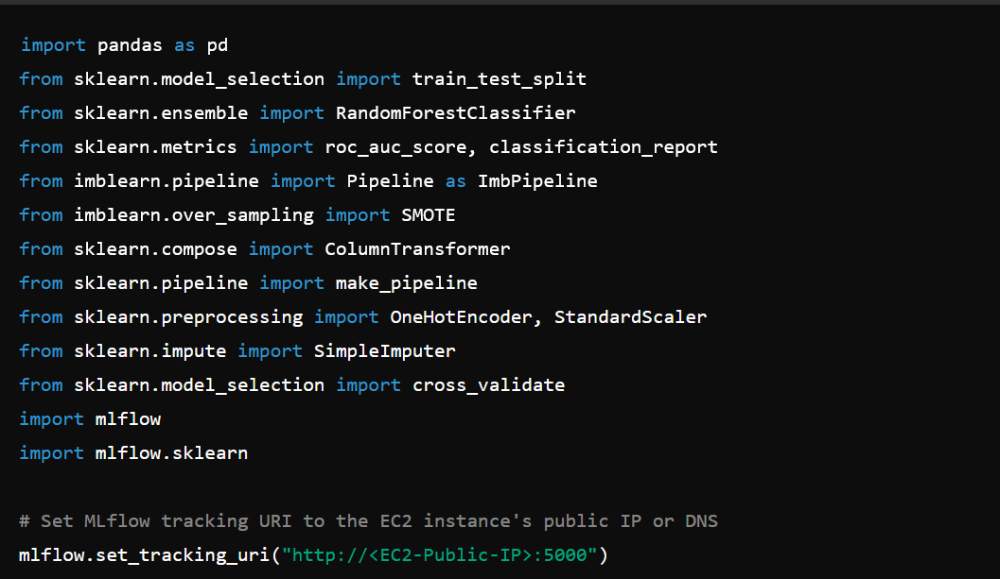
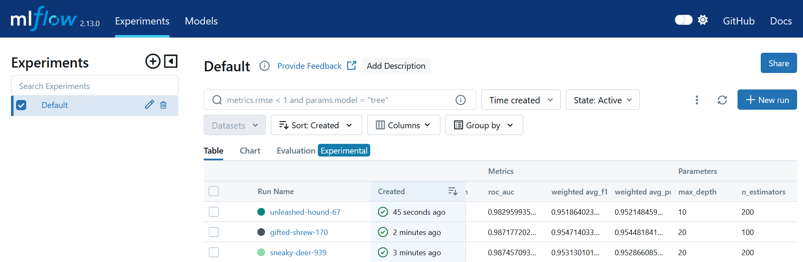

# Bank Churners ML Flow 
[](https://www.python.org/)
[](https://mlflow.org/)
[](https://www.terraform.io/)
[](https://aws.amazon.com/)

## 📒 Description
This project is an exercise on deploying ML Flow to track and monitor a Bank Churn Classification model created by a colleague, [CoVictor](https://github.com/CoViktor/customer_churn_analysis/blob/main/Classification/Rand_forest.ipynb), as part of a student exercise at [BeCode](https://becode.org/).

It aims to deploy ML Flow in AWS Cloud using Terraform.

##  📦 Repo Structure 
```
├── terraform-setup/
│   ├── providers.tf
│   ├── s3.tf
│   ├── rds.tf
│   ├── security_groups.tf
│   ├── iam.tf
│   ├── ec2.tf
│   ├── outputs.tf
│   └── user_data.sh.tpl
├── assets/
│   ├── Rand_forest.ipynb (from CoVictor)
│   └── Screenshot-mlflow.png
├── data/
│   └── BankChurners.csv
├── mlflow-experiment.py
├── requirements.txt
└── README.md
```

## 🛠 Pre-requisites
This project requires **MLFlow** and **Terraform** to be installed and running.

## 🎮 Usage

1. **Clone the repository**: 

    ```
    git clone https://github.com/gnadela/bank-churners-mlflow-terraform
    ```

2. **Install dependencies**: 

    ```
    pip install -r requirements.txt
    ```

3. **Deploy ML Flow Tracking Server in AWS using Terraform**: 

    ```
    cd terraform-setup
    terraform init
    terraform plan
    terraform apply
    ```

4. **Update Python Script**
    
    Use a text editor to open the Python script ***'mlflow-experiment.py'***.
    Set the ***mlflow.set_tracking_uri*** to point to your AWS EC2 instance's MLflow server.

    


5. **Save and run the python script**

    ```
    python mlflow-experiment.py
    ```


## ML Flow


## 🕐 Timeline

This project was created in 8 days.